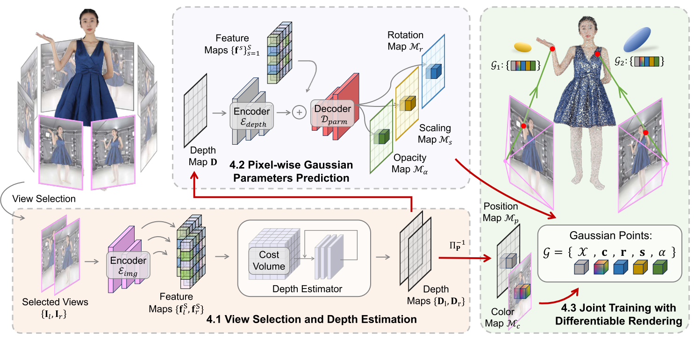
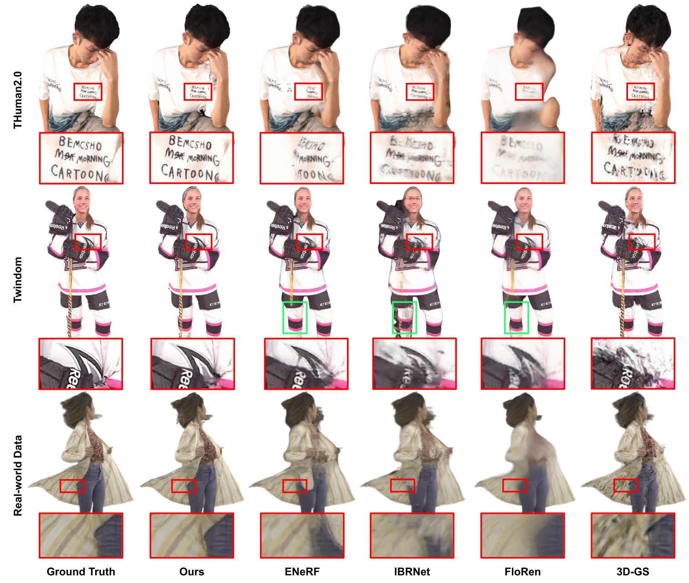
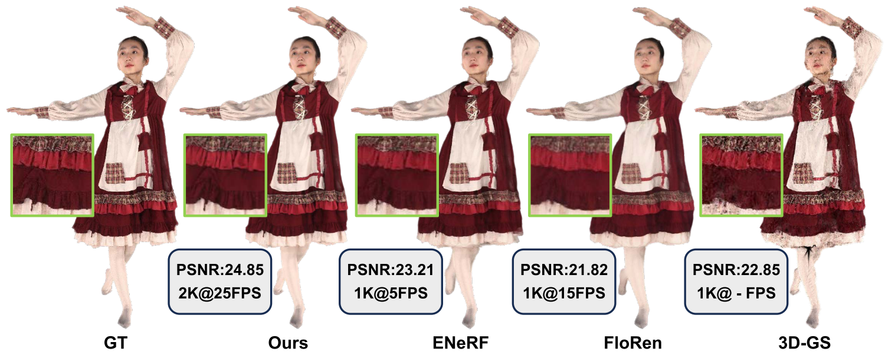

# GPS-Gaussian: Generalizable Pixel-wise 3D Gaussian Splatting for Real-time Human Novel View Synthesis

- [x] 跑通GPS-Gaussian，已跑通论文给的测试数据
- [x] 阅读GPS-Guassian论文
- [ ] 阅读RAFT-Stereo论文
- [ ] 处理自己采集的数据
- [ ] 使用GPS-Guassian验证自采数据结果

## 论文给的测试数据结果

[自己复现的结果](Results\论文里的测试数据\test_out.mp4)\
[用论文checkpoint跑的结果](Results\论文里的测试数据\test_out1.mp4)

## GPS-Guassian论文阅读
### 方法
GPS-Guassian算法步骤如下：

1. 给定目标视点$V_{tar}$，首先在源视点集中选择最近的两个视点对应的图像作为立体匹配的左右图像$I_l$和$I_r$。
2. 使用类似RAFT-Stereo的迭代视差估计算法来计算视差（避免使用较慢的3D卷积），然后通过视差来计算深度：
   $$
   \begin{equation}
    Z = \frac{fB}{d}
   \end{equation}
   $$
   其中，$f$是焦距，$B$是基线（两个视点之间的距离），$d$是估计的视差
3. 可以根据深度将像素点反投影到三维空间得到$\mathcal{M}_p$
4. 直接将图像的像素值作为$\mathcal{M}_c$
5. $\mathcal{M}_o$， $\mathcal{M}_s$和$\mathcal{M}_r$这三个高斯参数通常与（1）像素级局部特征、（2）人体的全局上下文和（3）详细的空间结构有关。为此本文使用一个类似UNet的结构将深度和特征图结合来预测这三个参数。
   $$
   \begin{equation}
   \boldsymbol{\Gamma}=\mathcal{D}_{\text {parm }}\left(\mathcal{E}_{\text {img }}(\mathbf{I}) \oplus \mathcal{E}_{\text {depth }}(\mathbf{D})\right)
   \end{equation}
   $$
   $$
   \begin{equation}
    \begin{aligned}
    \mathcal{M}_{r}(x) & = \operatorname{Norm}\left(h_{r}(\boldsymbol{\Gamma}(x))\right)\\
    \mathcal{M}_{s}(x) & = \operatorname{Softplus}\left(h_{s}(\boldsymbol{\Gamma}(x))\right) \\
    \mathcal{M}_{\alpha}(x) & = \operatorname{Sigmoid}\left(h_{\alpha}(\boldsymbol{\Gamma}(x))\right)\\
    \end{aligned}
   \end{equation}
    $$
6. 经由可微渲染的联合训练，主要包括两部分损失：渲染损失和深度损失：
   $$
   \begin{equation}
    \begin{aligned}
    \mathcal{L}_{\text {render }} & = \beta L_{\text {mae }}+\gamma \mathcal{L}_{\text {ssim }}\\
    \mathcal{L}_{\text {disp }} & = \sum_{t = 1}^{T} \mu^{T-t}\left\|\mathbf{d}_{g t}-\mathbf{d}^{t}\right\|_{1}\\
    \mathcal{L} & = \mathcal{L}_{\text {render }}+\mathcal{L}_{\text {disp }}
    \end{aligned}
   \end{equation}
   $$ 

### 实验结果
从实验结果上看本文的方法比之前的方法可以更好地建模局部细节，如文字，裤子褶皱等。

该算法比之前的算法达到了更好的性能与速度的平衡

## 参考文献
[1] Lipson, Lahav, Zachary Teed, and Jia Deng. "Raft-stereo: Multilevel recurrent field transforms for stereo matching." In 2021 International Conference on 3D Vision (3DV), pp. 218-227. IEEE, 2021.